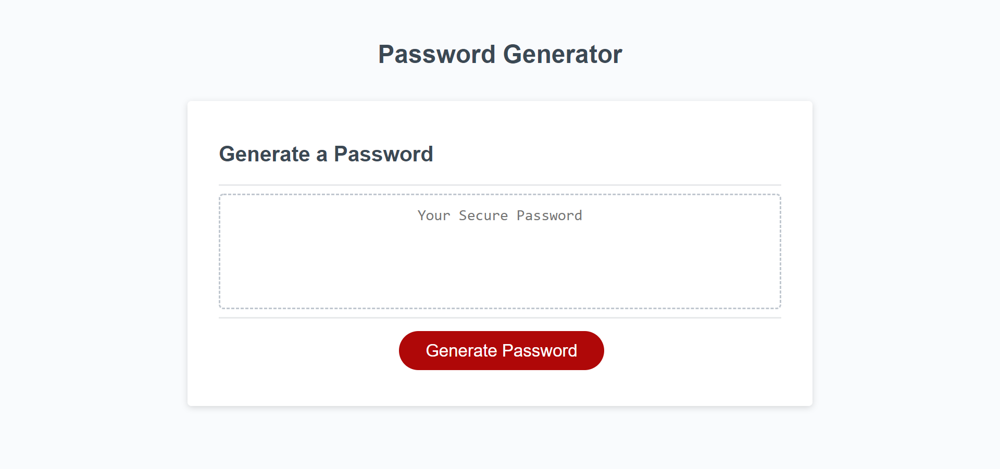

  # Password-Generator

   
  
  ## Table of Contents 

  * [Description](#description)

  * [Screenshots](#screenshots)
  
  * [Installation](#installation)
  
  * [Usage](#usage)
  
  * [Contributing](#contributing)
  
  * [Tests](#tests)

  * [License](#license)

  * [Questions](#questions)

  ## Description

  If you can never create a unique secure password this application might be what you are looking for. The application is simple for users as the user will be asked how many characters they will want, any numeric characters, and special characters. Once the prompts are filled out and finished, the random password will be displayed on the page for the user to copy.

  ## Screenshots

  
  
  ## Installation 
    
  No installation requirements are necessary as this application is primarily a frontend application
  
  ## Contributing

  If you would like to contribute, email me first.
  
  ## License

  This project is licensed under the MIT license 

  ## Questions
  
  If you have any questions about the repo, open an issue contact me directly at [midthun23@gmail.com](mailto:midthun23@gmail.com). You can find more work at [midth002](https://github.com/midth002)
  